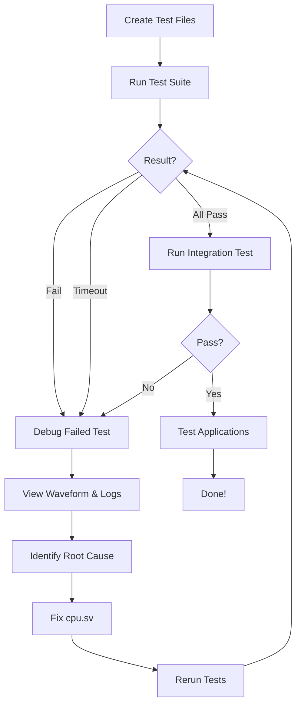

# Quick Start: CPU Debugging Workflow

This is your step-by-step guide to debug the processor core using the new verification approach.

## Prerequisites

- RISC-V toolchain installed (`riscv64-unknown-elf-gcc`)
- Icarus Verilog installed (`iverilog`)
- Surfer or GTKWave for waveform viewing
- Bash shell

## Step 1: Create Test Files (One-Time Setup)

You need to switch to **Code mode** to create the test files, as Architect mode can only edit markdown files.

### Option A: Use Code Mode to Create All Files

Ask the AI to switch to Code mode and create:
1. All test files from [`automation_guide.md`](automation_guide.md)
2. Enhanced testbench `test/tb_debug.sv`
3. Automation script `test/run_all_tests.sh`

### Option B: Manual Creation

If you prefer to create files manually:

```bash
# 1. Create directory
mkdir -p test/unit

# 2. Copy existing files
cp test/isa/boot.s test/unit/
cp test/isa/link.ld test/unit/

# 3. Create test files
# Copy content from automation_guide.md for:
# - test/unit/common.h
# - test/unit/test_1_1_simple_call.c through test_1_9_array_access.c
# - test/tb_debug.sv
# - test/run_all_tests.sh

# 4. Make script executable
chmod +x test/run_all_tests.sh
```

## Step 2: Run the Verification Suite

```bash
cd test
./run_all_tests.sh
```

## Step 3: Interpret Results

### Scenario A: All Tests Pass ✓

```
All tests passed! ✓
```

**Action**: The basic operations work! The issue might be in more complex scenarios.
- Run the existing integration test: `cd test/isa && just build && just install && cd ../.. && iverilog -g2012 -o tb.vvp test/tb_comprehensive.sv cpu.sv && vvp tb.vvp`
- If integration test fails, the issue is in complex interactions (e.g., multiple nested calls, large stack frames)

### Scenario B: Test Fails ✗

```
[4/9] test_1_4_stack_usage         ... FAIL ✗

  → Check waveform: results_20260220_210000/test_1_4_stack_usage.vcd
  → Check disassembly: unit/test_1_4_stack_usage.disasm
  → Check log: results_20260220_210000/test_1_4_stack_usage.log
```

**Action**: You found the bug! Proceed to Step 4.

### Scenario C: Test Timeouts ⏱

```
[5/9] test_1_5_nested_calls        ... TIMEOUT ⏱
```

**Action**: CPU is stuck in an infinite loop or not executing correctly.
- Check waveform to see where PC stops incrementing
- Look for incorrect branch/jump behavior

## Step 4: Debug the Failed Test

### 4.1 View the Disassembly

```bash
less test/unit/test_1_4_stack_usage.disasm
```

Look for:
- Function prologue (stack pointer adjustment, register saves)
- Function epilogue (register restores, return)
- The exact instructions being executed

### 4.2 View the Execution Log

```bash
less test/results_YYYYMMDD_HHMMSS/test_1_4_stack_usage.log
```

Look for:
- Last PC value before failure
- Memory access patterns
- Register values (ra, sp)

### 4.3 Open the Waveform

```bash
surfer test/results_YYYYMMDD_HHMMSS/test_1_4_stack_usage.vcd
```

Key signals to examine:
- `pc` - Program counter (where did it fail?)
- `state` - FSM state (stuck in which state?)
- `regfile[1]` (ra) - Return address (corrupted?)
- `regfile[2]` (sp) - Stack pointer (incorrect value?)
- `bus_addr` - Memory address being accessed
- `bus_rdata` - Data read from memory
- `bus_wdata` - Data written to memory
- `dmem_ce`, `dmem_read`, `dmem_we` - Memory control signals

### 4.4 Common Failure Patterns

#### Pattern 1: Wrong Return Address
**Symptom**: PC jumps to wrong address after function return
**Waveform**: Check `regfile[1]` (ra) - is it correct?
**Likely Cause**: `jalr` instruction not working correctly, or `ra` corrupted during function call
**Fix Location**: [`cpu.sv:933-936`](../cpu.sv:933) (JALR implementation)

#### Pattern 2: Stack Corruption
**Symptom**: Local variables or saved registers have wrong values
**Waveform**: Check `regfile[2]` (sp) - does it decrement/increment correctly?
**Likely Cause**: Stack pointer arithmetic error
**Fix Location**: Check load/store address calculation in [`cpu.sv:876-889`](../cpu.sv:876)

#### Pattern 3: Memory Read Returns Wrong Data
**Symptom**: Loaded value doesn't match what was stored
**Waveform**: Compare `bus_wdata` (during store) with `bus_rdata` (during load)
**Likely Cause**: RAM latency not properly handled
**Fix Location**: FSM timing in [`cpu.sv:955-1113`](../cpu.sv:955) (MEMORY1/MEMORY2 states)

#### Pattern 4: Infinite Loop
**Symptom**: PC keeps repeating same instructions
**Waveform**: PC doesn't advance or loops between same addresses
**Likely Cause**: Branch condition error or PC update issue
**Fix Location**: [`cpu.sv:907-926`](../cpu.sv:907) (Branch instructions) or [`cpu.sv:1122`](../cpu.sv:1122) (PC update)

## Step 5: Fix the Bug

Based on your analysis, edit [`cpu.sv`](../cpu.sv) to fix the issue.

**Important**: You'll need to switch to **Code mode** to edit `cpu.sv`.

Common fixes:

### Fix 1: RAM Latency Issue
If data is read one cycle too early/late, adjust the FSM:

```systemverilog
// In EXECUTE state for loads
bus_addr <= regfile[rs1] + imm;
dmem_ce <= 1;
dmem_read <= 1;

// In MEMORY1 - keep signals stable
dmem_ce <= 1;
dmem_read <= 1;

// In MEMORY2 - sample data
tmp_rd <= bus_rdata;  // Data should be valid now
```

### Fix 2: Address Calculation
Ensure address is calculated and held stable:

```systemverilog
// Address must be stable from EXECUTE through MEMORY2
// Check that bus_addr is not overwritten
```

### Fix 3: Control Signal Timing
Ensure control signals are asserted for the right duration:

```systemverilog
// Signals must be held for full 2 cycles for RAM latency
```

## Step 6: Retest

```bash
cd test
./run_all_tests.sh --continue-from test_1_4_stack_usage
```

This will skip tests that already passed and continue from the failed test.

## Step 7: Verify Complete Fix

Once all unit tests pass:

```bash
# Run integration test
cd test/isa
just build
just install
cd ../..
iverilog -g2012 -o tb.vvp test/tb_comprehensive.sv cpu.sv
vvp tb.vvp
```

Expected output:
```
TEST PASSED at PC: 0x...
```

## Step 8: Test Real Applications

```bash
# Test the snake-simple-fcalltest application
cd apps/snake-simple-fcalltest
just build
# Deploy to FPGA or run in simulation
```

## Troubleshooting

### "Command not found: riscv64-unknown-elf-gcc"
Install RISC-V toolchain or check PATH.

### "Permission denied: ./run_all_tests.sh"
```bash
chmod +x test/run_all_tests.sh
```

### "File not found: ram.mi"
```bash
touch ram.mi led.mi
```

### All tests timeout immediately
- Check that ROM is loaded: Look for "ROM loaded" message in simulation output
- Verify `rom.mi` exists and contains valid instructions
- Check reset logic in testbench

### Waveform is too large
- Use `-DENABLE_TRACE` only when needed
- Reduce timeout in testbench
- Focus on specific signals in Surfer

## Summary Workflow



## Key Differences from Previous Approach

| Previous | New |
|----------|-----|
| One large integration test | 9 small isolated tests |
| Hard to find bug location | Exact operation that fails |
| Manual test execution | Automated test suite |
| Complex waveforms | Minimal, focused waveforms |
| Unclear what to fix | Clear failure pattern |

## Expected Timeline

- **Setup**: 1-2 hours (one-time)
- **Run tests**: 5 minutes
- **Debug cycle**: 30 minutes per issue
- **Total**: 2-4 hours to find and fix all bugs

## Getting Help

If stuck:
1. Check the waveform at the exact cycle where the test writes to MAGIC_ADDR
2. Compare the disassembly with what you see in the waveform
3. Trace backwards from the failure point
4. Check if the issue is in instruction decode, execute, or memory access
5. Verify register values match expected values from disassembly

## Next Steps

1. ✅ Read this guide
2. ⬜ Create test files (switch to Code mode)
3. ⬜ Run test suite
4. ⬜ Debug first failure
5. ⬜ Fix and retest
6. ⬜ Verify with integration test
7. ⬜ Test applications
8. ⬜ Celebrate! 🎉
