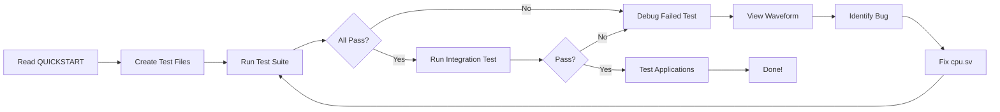

# CPU Debugging Plan - Documentation Index

This directory contains the complete debugging plan for the RISC-V RV32I processor core, specifically targeting issues with function calls and memory variable access.

## 📋 Document Overview

### 1. [QUICKSTART.md](QUICKSTART.md) - **START HERE**
Your step-by-step execution guide. Read this first!

**Contents**:
- Prerequisites and setup
- How to run the verification suite
- How to interpret results
- Debugging workflow
- Common failure patterns and fixes

**Use this when**: You're ready to start debugging.

### 2. [debugging_plan.md](debugging_plan.md) - Detailed Analysis
Comprehensive analysis of the current implementation and verification strategy.

**Contents**:
- Critical issues identified in CPU implementation
- Analysis of current verification approach
- Updated verification strategy with 9 unit tests
- RAM timing analysis
- Comparison with previous approach

**Use this when**: You need to understand the technical details and rationale.

### 3. [automation_guide.md](automation_guide.md) - Implementation Details
Complete code listings for all test files and automation scripts.

**Contents**:
- All 9 unit test source files
- Enhanced testbench with detailed tracing
- Automation script for running tests
- Usage instructions
- Troubleshooting guide

**Use this when**: Creating the test files (in Code mode).

### 4. [verification_plan.md](verification_plan.md) - Original Plan
The original verification plan created before this debugging effort.

**Use this when**: Understanding the original approach.

### 5. [verification_guide.md](verification_guide.md) - Original Guide
The original guide for running verification tests.

**Use this when**: Running the existing integration tests.

### 6. [architecture.md](architecture.md) - System Architecture
Documentation of the CPU core and system architecture.

**Use this when**: Understanding the overall system design.

## 🚀 Quick Start

1. **Read**: [`QUICKSTART.md`](QUICKSTART.md)
2. **Switch to Code mode** to create test files
3. **Run**: `cd test && ./run_all_tests.sh`
4. **Debug**: Follow the guide based on which test fails
5. **Fix**: Edit `cpu.sv` to resolve the issue
6. **Verify**: Rerun tests until all pass

## 🎯 Key Improvements Over Previous Approach

| Aspect | Previous | New |
|--------|----------|-----|
| **Test Granularity** | 1 large integration test | 9 isolated unit tests |
| **Failure Isolation** | Difficult - multiple operations mixed | Easy - exact operation identified |
| **Automation** | Manual execution | Fully automated test suite |
| **Debugging Time** | Hours (complex waveforms) | Minutes (focused waveforms) |
| **Observability** | Limited tracing | Detailed execution traces |
| **Reproducibility** | Manual steps | One-command execution |

## 🔍 What This Plan Addresses

### Identified Issues

1. **RAM Module Latency**: 2-cycle read latency may not be properly handled by FSM
2. **Signal Timing**: Control signals may not be stable for required duration
3. **Function Call Stack**: Stack pointer and return address management
4. **Global Variables**: Memory addressing and timing for `.data` and `.bss` sections

### Test Coverage

The 9 unit tests progressively test:
1. Simple function call (no stack)
2. Return value passing
3. Argument passing
4. Stack frame allocation
5. Nested calls (ra save/restore)
6. Global variable read
7. Global variable write
8. Function accessing globals
9. Array access (consecutive memory operations)

## 📊 Expected Outcomes

### Success Criteria
- ✅ All 9 unit tests pass
- ✅ Integration test passes
- ✅ Complex applications work (snake-simple-fcalltest)

### Likely Failure Points
Based on code analysis, expect failures in:
- **Test 1.4 or 1.5**: Stack operations (RAM latency)
- **Test 1.8 or 1.9**: Global variable access (addressing/timing)

## 🛠️ Tools Required

- `riscv64-unknown-elf-gcc` - RISC-V cross-compiler
- `iverilog` - Verilog simulator
- `surfer` or `gtkwave` - Waveform viewer
- `bash` - Shell for automation script

## 📁 File Structure

```
test/
├── unit/                          # Unit tests (to be created)
│   ├── common.h
│   ├── test_1_1_simple_call.c
│   ├── test_1_2_return_value.c
│   ├── test_1_3_single_arg.c
│   ├── test_1_4_stack_usage.c
│   ├── test_1_5_nested_calls.c
│   ├── test_1_6_global_read.c
│   ├── test_1_7_global_write.c
│   ├── test_1_8_func_global.c
│   ├── test_1_9_array_access.c
│   ├── boot.s
│   └── link.ld
├── tb_debug.sv                    # Enhanced testbench (to be created)
├── run_all_tests.sh               # Automation script (to be created)
├── isa/                           # Existing integration tests
│   ├── integration_test.c
│   ├── arithmetic.s
│   └── ...
└── tb_comprehensive.sv            # Existing testbench
```

## ⏱️ Estimated Timeline

- **Setup** (one-time): 1-2 hours
  - Create test files
  - Create testbench
  - Create automation script
- **Execution**: 5 minutes per test run
- **Debug cycle**: 30 minutes per issue
- **Total**: 2-4 hours to find and fix all bugs

## 🔄 Workflow Diagram



## 📝 Notes

- **Architect mode limitation**: Can only edit `.md` files. Switch to **Code mode** to create test files and edit `cpu.sv`.
- **Automation**: The test suite stops on first failure to allow focused debugging.
- **Incremental**: Tests are ordered from simple to complex to isolate issues early.
- **Reproducible**: All tests are deterministic and can be rerun reliably.

## 🆘 Getting Help

If you encounter issues:

1. Check [`QUICKSTART.md`](QUICKSTART.md) troubleshooting section
2. Review [`debugging_plan.md`](debugging_plan.md) for technical details
3. Examine waveforms at failure points
4. Compare disassembly with expected behavior
5. Check RAM timing analysis in debugging_plan.md

## 🎓 Learning Resources

- **RISC-V ISA Spec**: Understanding instruction behavior
- **Verilog FSM Design**: Understanding the CPU implementation
- **Memory Timing**: Understanding RAM latency and pipelining

## ✅ Checklist

Before starting:
- [ ] Read QUICKSTART.md
- [ ] Understand the test strategy
- [ ] Have tools installed
- [ ] Switch to Code mode

During debugging:
- [ ] Run test suite
- [ ] Identify failed test
- [ ] Examine waveform
- [ ] Review disassembly
- [ ] Identify root cause
- [ ] Fix cpu.sv
- [ ] Retest

After fixing:
- [ ] All unit tests pass
- [ ] Integration test passes
- [ ] Applications work
- [ ] Document findings

## 📞 Next Steps

1. **Read** [`QUICKSTART.md`](QUICKSTART.md) thoroughly
2. **Switch to Code mode** to create the test infrastructure
3. **Execute** the verification suite
4. **Debug** systematically using the provided tools
5. **Verify** the fix with all test levels

Good luck with the debugging! The systematic approach should help you quickly identify and fix the issues with function calls and memory access.
