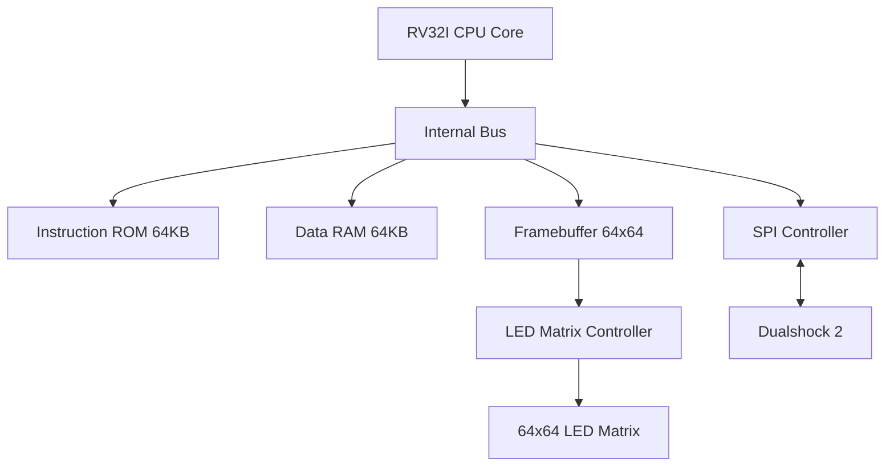

# System Architecture: RISC-V RV32I Core

This document describes the hardware architecture of the RISC-V core and its peripherals.

## CPU Core
- **Instruction Set**: RV32I (User-mode). **Note: Multiplication (M-extension) is NOT supported.**
- **Implementation**: 6-stage multi-cycle FSM
- **Stages**:
  1. `FETCH`: Fetch instruction from ROM
  2. `DECODE`: Decode instruction and prepare immediates
  3. `EXECUTE`: Perform ALU operations or calculate addresses
  4. `MEMORY1`: Initiate memory access (RAM, Framebuffer, SPI)
  5. `MEMORY2`: Complete memory access and sample read data
  6. `WRITEBACK`: Write result to register file

## Memory Map
The system uses a simple memory-mapped I/O scheme:

| Address Range | Device | Description |
|---------------|--------|-------------|
| `0x0000_0000` - `0x0000_FFFF` | **ROM** | Instruction Memory (imem) |
| `0x0001_0000` - `0x0001_FFFF` | **RAM** | Data Memory (dmem) |
| `0x0002_0000` - `0x0002_FFFF` | **Framebuffer** | 64x64 LED Matrix Buffer |
| `0x0003_0000` - `0x0003_FFFF` | **SPI Controller** | Dualshock 2 Controller Interface |

## Peripherals

### SPI Controller
- Continuously polls a PS2 Dualshock 2 controller.
- Maps controller buttons to a 16-bit register.
- Accessible at `0x0003_0000`.
- Buttons are active-low on the wire but inverted in hardware for active-high logic in C.

### LED Controller & Framebuffer
- **Framebuffer**: Dual-ported RAM to allow simultaneous CPU writes and LED controller reads.
- **LED Controller**: Drives a HUB75E-compatible 64x64 LED matrix.
- **Resolution**: 64x64 pixels.
- **Color Depth**: 3 bits (mapped to `dout_a` and `dout_b` signals).

## Build System
- Applications are located in `apps/`.
- Uses `riscv64-unknown-elf-gcc` targeting `rv32i`.
- `justfile` or `Makefile` handles compilation, binary generation, and `.mi` (memory initialization) file creation.

## Mermaid Diagram: System Overview

