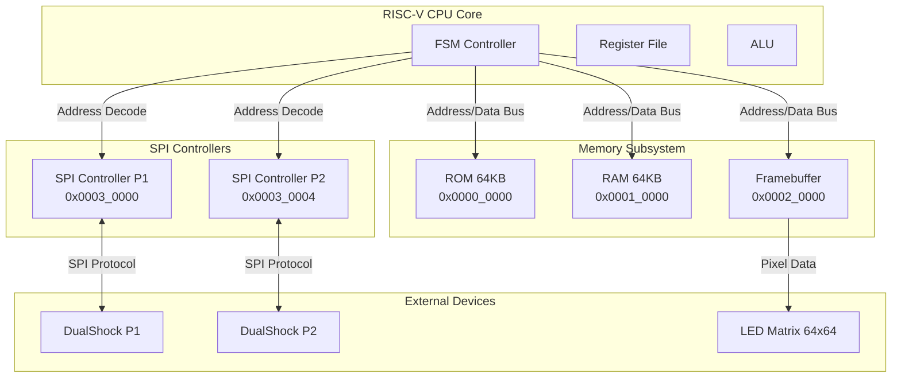
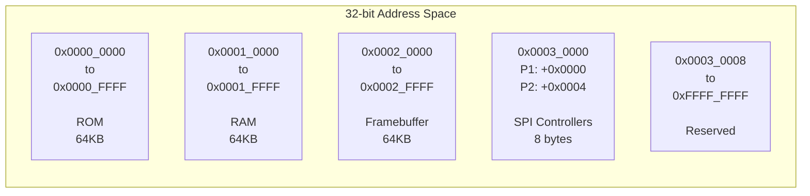
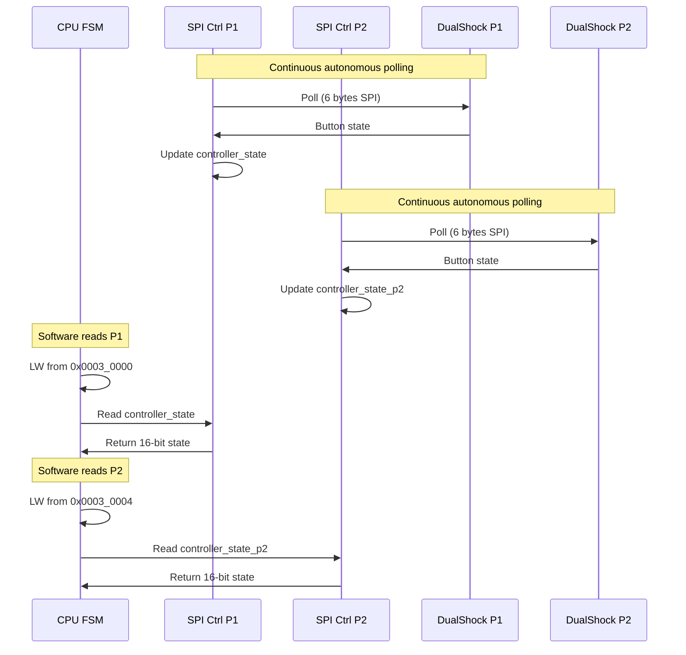
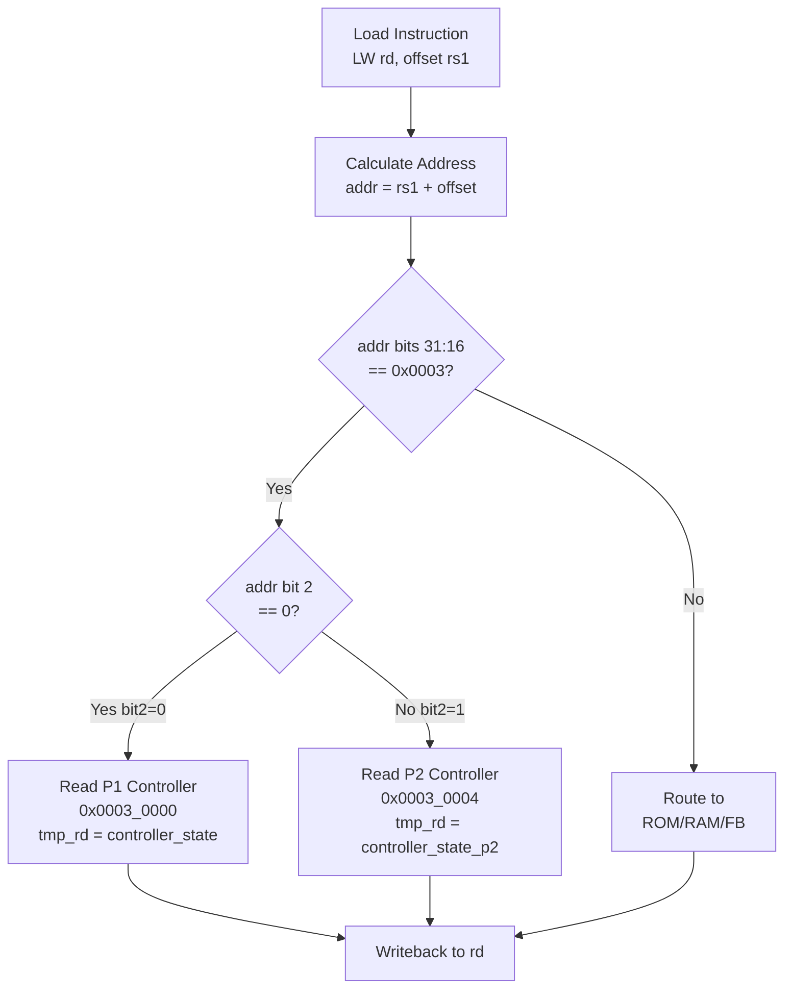
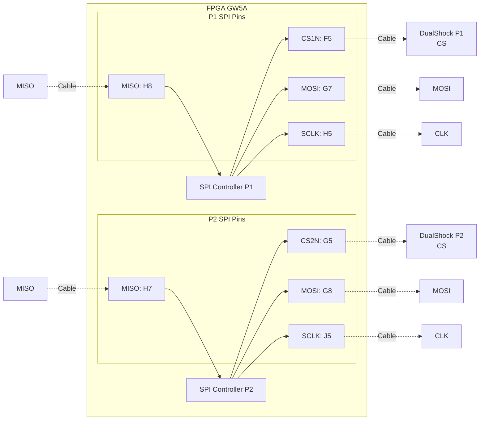
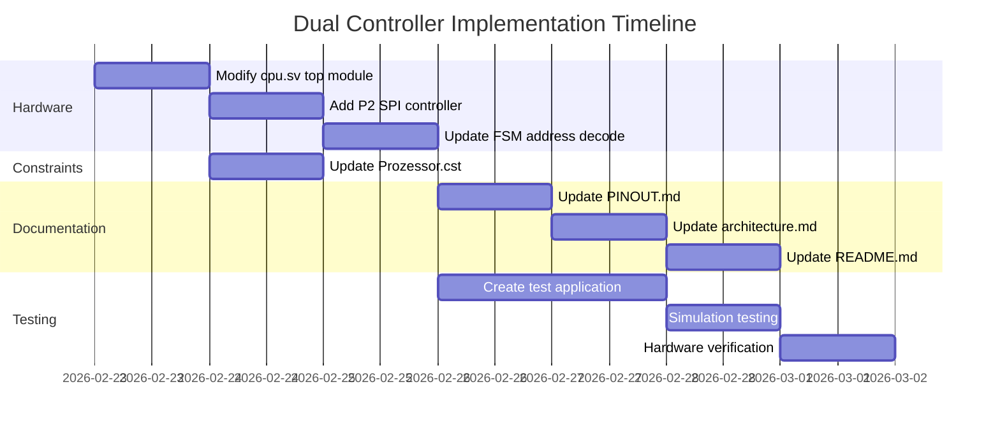
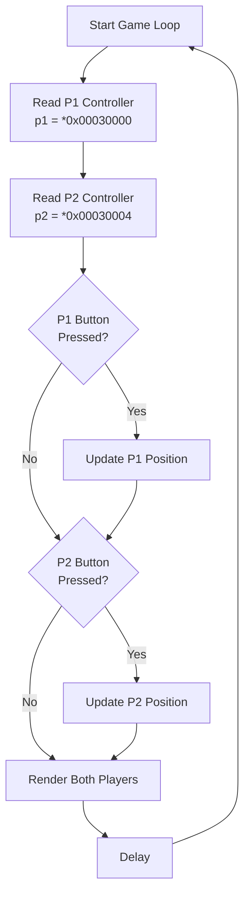
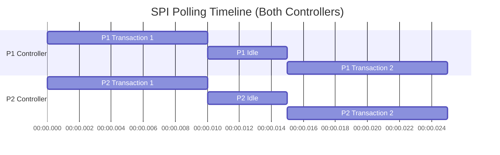

# Dual Controller Architecture Diagrams

## System Overview



## Memory Map Layout



## SPI Controller Data Flow



## FSM Address Decoding Logic



## Pin Connections



## Controller State Register Format

Both P1 and P2 use the same 16-bit format:

```
Bit 15: LEFT
Bit 14: DOWN
Bit 13: RIGHT
Bit 12: UP
Bit 11: START
Bit 10: R3
Bit 9:  L3
Bit 8:  SELECT
Bit 7:  SQUARE
Bit 6:  CROSS
Bit 5:  CIRCLE
Bit 4:  TRIANGLE
Bit 3:  R1
Bit 2:  L1
Bit 1:  R2
Bit 0:  L2

Note: All bits are active-high in software
      Hardware inverts the active-low signals from controller
```

## Implementation Phases



## Software Usage Example



## Resource Utilization Estimate

| Resource | Current | After P2 | Increase |
|----------|---------|----------|----------|
| SPI Controller Modules | 1 | 2 | +100% |
| 16-bit Registers | 1 | 2 | +100% |
| FSM Logic | Baseline | +5% | Address decode |
| I/O Pins | 4 (P1) | 8 (P1+P2) | +4 pins |
| Total LUTs | ~X | ~X+50 | Minimal |

Note: Second SPI controller is identical to first, so resource usage is predictable and minimal.

## Timing Considerations



**Note**: Both controllers poll independently and simultaneously. Polling rate: ~66Hz per controller (15ms per transaction).

## Address Decode Truth Table

| Address | Bit 31:16 | Bit 2 | Selected Controller | Data Source |
|---------|-----------|-------|---------------------|-------------|
| 0x0003_0000 | 0x0003 | 0 | P1 | controller_state |
| 0x0003_0004 | 0x0003 | 1 | P2 | controller_state_p2 |
| 0x0003_0008 | 0x0003 | - | Reserved | - |
| 0x0001_xxxx | 0x0001 | - | RAM | dmem_rdata |
| 0x0002_xxxx | 0x0002 | - | Framebuffer | - |
