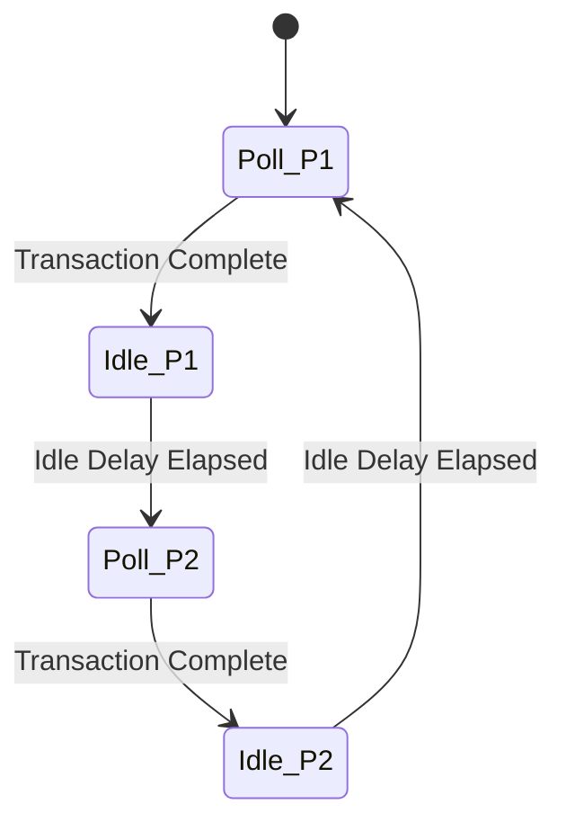

# Dual PS2 DualShock Controller Support - Design Plan

## Overview
This document describes the design for adding support for a second PS2 DualShock controller to the RISC-V RV32I FPGA Core. The implementation will use a round-robin polling scheme to alternate between reading the two controllers.

## Current Implementation Analysis

### Existing SPI Controller (P1)
- **Module**: `spi_controller` in [`cpu.sv`](../cpu.sv:170-339)
- **Memory Address**: `0x0003_0000`
- **Pin Assignments** (from [`PINOUT.md`](../PINOUT.md)):
  - CS1N: F5
  - MOSI: G7
  - MISO: H8
  - SCLK: H5
- **Controller State**: 16-bit register storing button states
- **Polling**: Continuous polling with idle delay between transactions
- **Data Format**: Active-high in software (hardware inverts active-low signals)

### Current FSM Integration
The CPU FSM handles SPI reads in the following stages:
1. **EXECUTE**: Detects address range `0x0003_xxxx` and sets `spi_ce` and `spi_re`
2. **MEMORY1**: Maintains control signals
3. **MEMORY2**: Reads `controller_state` and loads into `tmp_rd`

## Design Requirements

### Functional Requirements
1. Add second SPI controller instance for P2
2. Map P2 controller state to address `0x0003_0004`
3. Implement round-robin polling between P1 and P2
4. Maintain backward compatibility with existing P1 controller code
5. Support independent reads of P1 and P2 controller states

### Hardware Requirements
1. Second set of SPI pins (CS2N, MOSI2, MISO2, SCLK2)
2. Second 16-bit controller state register
3. Polling arbiter to alternate between controllers

## Proposed Architecture

### Memory Map Extension

| Address | Device | Description |
|---------|--------|-------------|
| `0x0003_0000` | **SPI Controller P1** | Player 1 Controller State (16-bit) |
| `0x0003_0004` | **SPI Controller P2** | Player 2 Controller State (16-bit) |
| `0x0003_0008` - `0x0003_FFFF` | Reserved | Future expansion |

### Round-Robin Polling Strategy



**Polling Sequence**:
1. Poll P1 controller (6 bytes SPI transaction)
2. Wait idle delay
3. Poll P2 controller (6 bytes SPI transaction)
4. Wait idle delay
5. Repeat

**Benefits**:
- Fair polling of both controllers
- Predictable update rate for each controller
- Simple state machine extension
- No conflicts on shared resources

### Hardware Modifications

#### 1. Second SPI Controller Module

Add a second instance of the `spi_controller` module:

```systemverilog
// P1 Controller (existing)
spi_controller spi_ctrl_p1 (
    .clk(clk),
    .rst(rst),
    .miso(miso_p1),
    .mosi(mosi_p1),
    .cs_n(cs_n_p1),
    .spi_clk(spi_clk_p1),
    .controller_state(controller_state_p1),
    .poll_enable(poll_enable_p1)
);

// P2 Controller (new)
spi_controller spi_ctrl_p2 (
    .clk(clk),
    .rst(rst),
    .miso(miso_p2),
    .mosi(mosi_p2),
    .cs_n(cs_n_p2),
    .spi_clk(spi_clk_p2),
    .controller_state(controller_state_p2),
    .poll_enable(poll_enable_p2)
);
```

#### 2. Polling Arbiter

Add a simple arbiter to alternate polling between controllers:

```systemverilog
typedef enum logic [1:0] {
    POLL_P1 = 2'd0,
    WAIT_P1 = 2'd1,
    POLL_P2 = 2'd2,
    WAIT_P2 = 2'd3
} poll_state_t;

poll_state_t poll_state;
logic poll_enable_p1;
logic poll_enable_p2;
logic [15:0] controller_state_p1;
logic [15:0] controller_state_p2;

always @(posedge clk or posedge rst) begin
    if (rst) begin
        poll_state <= POLL_P1;
        poll_enable_p1 <= 1'b1;
        poll_enable_p2 <= 1'b0;
    end else begin
        case (poll_state)
            POLL_P1: begin
                poll_enable_p1 <= 1'b1;
                poll_enable_p2 <= 1'b0;
                if (spi_ctrl_p1_done) begin
                    poll_state <= WAIT_P1;
                end
            end
            WAIT_P1: begin
                poll_enable_p1 <= 1'b0;
                if (wait_timer_expired) begin
                    poll_state <= POLL_P2;
                end
            end
            POLL_P2: begin
                poll_enable_p1 <= 1'b0;
                poll_enable_p2 <= 1'b1;
                if (spi_ctrl_p2_done) begin
                    poll_state <= WAIT_P2;
                end
            end
            WAIT_P2: begin
                poll_enable_p2 <= 1'b0;
                if (wait_timer_expired) begin
                    poll_state <= POLL_P1;
                end
            end
        endcase
    end
end
```

**Note**: The current `spi_controller` module has built-in idle delay management. We need to modify it to accept an external `poll_enable` signal or implement the arbiter to work with the existing autonomous polling behavior.

**Alternative Simpler Approach**: Since the current SPI controller is autonomous (continuously polls), we can:
1. Keep both controllers polling independently
2. Simply add address decoding in the FSM to select which controller state to read

This is simpler and avoids modifying the SPI controller module. The controllers will poll at slightly different phases naturally.

#### 3. FSM Modifications

Update the FSM to handle reads from both controller addresses:

**EXECUTE Stage** (lines 870-883):
```systemverilog
7'b0000011: begin  // Load
    set_rd_flag <= 0;
    bus_addr <= regfile[rs1] + imm;
    if(((regfile[rs1] + imm) >> 16) == 16'h0001) begin
        dmem_ce <= 1;
        dmem_read <= 1;
    end
    // Read from P1 or P2 controller
    if(((regfile[rs1] + imm) >> 16) == 16'h0003) begin
        spi_ce <= 1'b1;
        spi_re <= 1'b1;
    end
end
```

**MEMORY2 Stage** (lines 1037-1047):
```systemverilog
if(bus_addr[31:16] == 16'h0003) begin
    spi_ce <= 1'b0;
    spi_re <= 1'b0;
    // Select controller based on address
    if(bus_addr[2] == 1'b0) begin
        // Address 0x0003_0000 - P1 controller
        tmp_rd <= {16'b0, controller_state_p1};
    end else begin
        // Address 0x0003_0004 - P2 controller
        tmp_rd <= {16'b0, controller_state_p2};
    end
end
```

#### 4. Top Module I/O

Add P2 controller pins to the top module:

```systemverilog
module topmodule (
    input  logic       clk,
    input  logic       rst,
    // ... existing signals ...
    
    // P1 SPI Controller
    output logic spi_clk_p1,
    output logic cs_n_p1,
    output logic mosi_p1,
    input  logic miso_p1,
    
    // P2 SPI Controller (new)
    output logic spi_clk_p2,
    output logic cs_n_p2,
    output logic mosi_p2,
    input  logic miso_p2,
    
    // ... rest of signals ...
);
```

### Pin Assignments

From [`PINOUT.md`](../PINOUT.md), P2 controller pins:

| Signal | FPGA Pin |
|--------|----------|
| CS2N   | G5       |
| MOSI   | G8       |
| MISO   | H7       |
| SCLK   | J5       |

These will be added to [`Prozessor.cst`](../Prozessor.cst).

## Implementation Steps

### Phase 1: Hardware Modifications
1. ✅ Modify `topmodule` to add P2 SPI pins
2. ✅ Instantiate second `spi_controller` module
3. ✅ Add `controller_state_p2` wire
4. ✅ Update FSM EXECUTE stage for P2 address detection
5. ✅ Update FSM MEMORY2 stage for P2 data read

### Phase 2: Pin Constraints
1. ✅ Update [`Prozessor.cst`](../Prozessor.cst) with P2 pin assignments
2. ✅ Verify no pin conflicts

### Phase 3: Documentation
1. ✅ Update [`PINOUT.md`](../PINOUT.md) with P2 pin table
2. ✅ Update [`plans/architecture.md`](architecture.md) memory map
3. ✅ Update [`README.md`](../README.md) with dual controller support
4. ✅ Create example application demonstrating dual controller usage

### Phase 4: Testing
1. ✅ Create test application reading both controllers
2. ✅ Verify independent controller reads
3. ✅ Test backward compatibility with P1-only code
4. ✅ Verify waveforms show correct address decoding

## Software Interface

### C Code Example

```c
#define CONTROLLER_P1 ((volatile uint16_t*)0x00030000)
#define CONTROLLER_P2 ((volatile uint16_t*)0x00030004)

// Button bit definitions (active-high)
#define BTN_UP    (1 << 12)
#define BTN_DOWN  (1 << 14)
#define BTN_LEFT  (1 << 15)
#define BTN_RIGHT (1 << 13)

void read_controllers(void) {
    uint16_t p1_state = *CONTROLLER_P1;
    uint16_t p2_state = *CONTROLLER_P2;
    
    if (p1_state & BTN_UP) {
        // Player 1 pressed UP
    }
    
    if (p2_state & BTN_UP) {
        // Player 2 pressed UP
    }
}
```

### Assembly Example

```assembly
# Read P1 controller
li   t0, 0x00030000
lw   t1, 0(t0)        # Load P1 state

# Read P2 controller
li   t0, 0x00030004
lw   t2, 0(t0)        # Load P2 state
```

## Verification Plan

### Unit Tests
1. **Test 1**: Read P1 controller state at `0x0003_0000`
2. **Test 2**: Read P2 controller state at `0x0003_0004`
3. **Test 3**: Alternate reads between P1 and P2
4. **Test 4**: Verify independent button states

### Integration Tests
1. Create dual-player snake game
2. Verify both controllers work simultaneously
3. Test edge cases (both controllers pressed same button)

### Waveform Verification
1. Verify P1 SPI transactions
2. Verify P2 SPI transactions
3. Verify address decoding in FSM
4. Verify correct data routing to `tmp_rd`

## Risks and Mitigations

### Risk 1: Pin Conflicts
**Mitigation**: Verify all P2 pins are available and not used by other peripherals.

### Risk 2: Timing Issues
**Mitigation**: Both controllers poll independently, no shared resources except CPU bus.

### Risk 3: Increased Resource Usage
**Mitigation**: Second SPI controller is identical to first, resource usage is predictable.

### Risk 4: Polling Rate Reduction
**Impact**: Each controller now polled at half the rate (alternating).
**Mitigation**: Polling rate is still sufficient for game controller input (~100Hz per controller).

## Future Enhancements

1. **Configurable Polling Priority**: Allow software to configure which controller polls more frequently
2. **Interrupt Support**: Generate interrupt when button state changes
3. **Additional Controllers**: Extend to 4 controllers using addresses `0x0003_0008` and `0x0003_000C`
4. **Controller Detection**: Add status register indicating which controllers are connected

## References

- [`cpu.sv`](../cpu.sv) - Main hardware implementation
- [`PINOUT.md`](../PINOUT.md) - Pin assignments
- [`plans/architecture.md`](architecture.md) - System architecture
- [`plans/controller_register_bits.md`](controller_register_bits.md) - Button mapping
