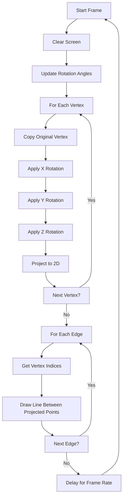

# Spinning 3D Wireframe Cube - Architecture Plan

## Overview
Implementation of a continuously rotating 3D wireframe cube on a 64x64 pixel display for a RISC-V RV32I processor without multiplication, division, or modulo operations.

## System Constraints

### Hardware Limitations
- **Processor**: RISC-V RV32I (user-mode only)
- **No M-Extension**: No hardware multiply/divide/modulo
- **Display**: 64x64 pixel LED matrix
- **Framebuffer**: Memory-mapped at `0x00020000`
- **Available Operations**: Addition, subtraction, bitwise operations, shifts

### Software Constraints
- Integer arithmetic only
- No floating-point support
- No standard math library
- Must use lookup tables for trigonometric functions

## Architecture Design

### 1. Fixed-Point Arithmetic System

#### Fixed-Point Format
- **Format**: Q16.16 (16-bit integer, 16-bit fractional)
- **Range**: -32768 to +32767 with 1/65536 precision
- **Scaling Factor**: 65536 (2^16)
- **Rationale**: Provides sufficient precision for rotation and projection while using 32-bit integers

#### Operations
```
Addition:       a + b (direct)
Subtraction:    a - b (direct)
Multiplication: (a * b) >> 16 (using software multiply)
Division:       (a << 16) / b (using software divide)
```

#### Software Multiply Implementation
Since hardware multiply is unavailable, implement using shift-and-add:
```c
int32_t fixed_mul(int32_t a, int32_t b) {
    // Multiply two Q16.16 numbers
    // Result needs to be shifted right by 16
    int32_t result = 0;
    int32_t negative = 0;
    
    // Handle signs
    if (a < 0) { a = -a; negative = !negative; }
    if (b < 0) { b = -b; negative = !negative; }
    
    // Shift-and-add multiplication
    while (b > 0) {
        if (b & 1) result += a;
        a <<= 1;
        b >>= 1;
    }
    
    // Shift result right by 16 for fixed-point
    result >>= 16;
    
    return negative ? -result : result;
}
```

### 2. Trigonometric Lookup Tables

#### Sine/Cosine Tables
- **Size**: 360 entries (one per degree)
- **Format**: Q16.16 fixed-point
- **Range**: -1.0 to +1.0 (stored as -65536 to +65536)
- **Memory**: 360 * 4 bytes * 2 tables = 2880 bytes

#### Table Generation (precomputed)
```c
// Sine table: sin_table[angle_degrees] = sin(angle) in Q16.16
const int32_t sin_table[360] = {
    0,      // sin(0°)   = 0.0
    1144,   // sin(1°)   ≈ 0.0175
    2287,   // sin(2°)   ≈ 0.0349
    ...
    65536,  // sin(90°)  = 1.0
    ...
    0,      // sin(180°) = 0.0
    ...
    -65536, // sin(270°) = -1.0
    ...
};

// Cosine can be derived: cos(x) = sin(x + 90)
```

#### Angle Management
```c
// Keep angles in range [0, 359]
int normalize_angle(int angle) {
    while (angle < 0) angle += 360;
    while (angle >= 360) angle -= 360;
    return angle;
}
```

### 3. Cube Geometry

#### Vertex Definition
8 vertices of a cube centered at origin:
```c
// Cube vertices in 3D space (Q16.16 format)
// Scale: ±10 units (±655360 in fixed-point)
const int32_t cube_vertices[8][3] = {
    {-655360, -655360, -655360},  // 0: (-10, -10, -10)
    { 655360, -655360, -655360},  // 1: ( 10, -10, -10)
    { 655360,  655360, -655360},  // 2: ( 10,  10, -10)
    {-655360,  655360, -655360},  // 3: (-10,  10, -10)
    {-655360, -655360,  655360},  // 4: (-10, -10,  10)
    { 655360, -655360,  655360},  // 5: ( 10, -10,  10)
    { 655360,  655360,  655360},  // 6: ( 10,  10,  10)
    {-655360,  655360,  655360}   // 7: (-10,  10,  10)
};
```

#### Edge Definition
12 edges connecting vertices:
```c
const int cube_edges[12][2] = {
    // Bottom face (z = -10)
    {0, 1}, {1, 2}, {2, 3}, {3, 0},
    // Top face (z = 10)
    {4, 5}, {5, 6}, {6, 7}, {7, 4},
    // Vertical edges
    {0, 4}, {1, 5}, {2, 6}, {3, 7}
};
```

### 4. 3D Rotation Transformations

#### Rotation Matrices
Rotate around X, Y, and Z axes using matrix multiplication.

**Rotation around X-axis:**
```
[1    0       0    ] [x]
[0  cos(θ) -sin(θ)] [y]
[0  sin(θ)  cos(θ)] [z]
```

**Rotation around Y-axis:**
```
[ cos(θ)  0  sin(θ)] [x]
[   0     1    0   ] [y]
[-sin(θ)  0  cos(θ)] [z]
```

**Rotation around Z-axis:**
```
[cos(θ) -sin(θ)  0] [x]
[sin(θ)  cos(θ)  0] [y]
[  0       0     1] [z]
```

#### Implementation Strategy
```c
typedef struct {
    int32_t x, y, z;  // Q16.16 format
} Vec3;

void rotate_x(Vec3* v, int angle_deg) {
    int32_t cos_a = sin_table[(angle_deg + 90) % 360];
    int32_t sin_a = sin_table[angle_deg];
    
    int32_t y_new = fixed_mul(v->y, cos_a) - fixed_mul(v->z, sin_a);
    int32_t z_new = fixed_mul(v->y, sin_a) + fixed_mul(v->z, cos_a);
    
    v->y = y_new;
    v->z = z_new;
}

void rotate_y(Vec3* v, int angle_deg) {
    int32_t cos_a = sin_table[(angle_deg + 90) % 360];
    int32_t sin_a = sin_table[angle_deg];
    
    int32_t x_new = fixed_mul(v->x, cos_a) + fixed_mul(v->z, sin_a);
    int32_t z_new = -fixed_mul(v->x, sin_a) + fixed_mul(v->z, cos_a);
    
    v->x = x_new;
    v->z = z_new;
}

void rotate_z(Vec3* v, int angle_deg) {
    int32_t cos_a = sin_table[(angle_deg + 90) % 360];
    int32_t sin_a = sin_table[angle_deg];
    
    int32_t x_new = fixed_mul(v->x, cos_a) - fixed_mul(v->y, sin_a);
    int32_t y_new = fixed_mul(v->x, sin_a) + fixed_mul(v->y, cos_a);
    
    v->x = x_new;
    v->y = y_new;
}
```

### 5. 3D to 2D Projection

#### Perspective Projection
Using simple perspective projection with camera distance:
```
screen_x = (x * distance) / (z + distance) + center_x
screen_y = (y * distance) / (z + distance) + center_y
```

#### Orthographic Projection (Simpler Alternative)
For initial implementation, use orthographic projection:
```
screen_x = x + center_x
screen_y = y + center_y
```

#### Implementation
```c
typedef struct {
    int x, y;  // Screen coordinates (pixels)
} Point2D;

Point2D project_vertex(Vec3* v) {
    Point2D p;
    
    // Orthographic projection with scaling
    // Scale down from ±10 units to ±15 pixels
    // Scaling factor: 15/10 = 1.5 = 98304 in Q16.16
    
    // x_screen = (x * scale) >> 16 + 32
    p.x = ((v->x * 98304) >> 16) + 32;
    p.y = ((v->y * 98304) >> 16) + 32;
    
    // Clamp to screen bounds
    if (p.x < 0) p.x = 0;
    if (p.x >= 64) p.x = 63;
    if (p.y < 0) p.y = 0;
    if (p.y >= 64) p.y = 63;
    
    return p;
}
```

### 6. Line Drawing - Bresenham's Algorithm

#### Integer-Only Implementation
```c
void draw_line(int x0, int y0, int x1, int y1, int r, int g, int b) {
    int dx = x1 - x0;
    int dy = y1 - y0;
    
    // Handle negative deltas
    int sx = (dx >= 0) ? 1 : -1;
    int sy = (dy >= 0) ? 1 : -1;
    
    if (dx < 0) dx = -dx;
    if (dy < 0) dy = -dy;
    
    int err = dx - dy;
    
    while (1) {
        fb_write(y0, x0, r, g, b);
        
        if (x0 == x1 && y0 == y1) break;
        
        int e2 = err << 1;
        
        if (e2 > -dy) {
            err -= dy;
            x0 += sx;
        }
        
        if (e2 < dx) {
            err += dx;
            y0 += sy;
        }
    }
}
```

### 7. Main Animation Loop

#### Frame Update Sequence


#### Implementation Structure
```c
int main() {
    int angle_x = 0;
    int angle_y = 0;
    int angle_z = 0;
    
    Vec3 rotated_vertices[8];
    Point2D projected_vertices[8];
    
    while (1) {
        // Clear screen
        clear_screen();
        
        // Update angles
        angle_x = (angle_x + 2) % 360;
        angle_y = (angle_y + 3) % 360;
        angle_z = (angle_z + 1) % 360;
        
        // Transform all vertices
        for (int i = 0; i < 8; i++) {
            // Copy original vertex
            rotated_vertices[i].x = cube_vertices[i][0];
            rotated_vertices[i].y = cube_vertices[i][1];
            rotated_vertices[i].z = cube_vertices[i][2];
            
            // Apply rotations
            rotate_x(&rotated_vertices[i], angle_x);
            rotate_y(&rotated_vertices[i], angle_y);
            rotate_z(&rotated_vertices[i], angle_z);
            
            // Project to 2D
            projected_vertices[i] = project_vertex(&rotated_vertices[i]);
        }
        
        // Draw all edges
        for (int i = 0; i < 12; i++) {
            int v0 = cube_edges[i][0];
            int v1 = cube_edges[i][1];
            
            draw_line(
                projected_vertices[v0].x,
                projected_vertices[v0].y,
                projected_vertices[v1].x,
                projected_vertices[v1].y,
                1, 1, 1  // White color
            );
        }
        
        // Frame delay
        for (int d = 0; d < 30000; d++) {
            asm volatile("nop");
        }
    }
    
    return 0;
}
```

## Performance Considerations

### Optimization Strategies

1. **Lookup Table Size**: 360 entries provides 1-degree precision, sufficient for smooth animation
2. **Fixed-Point Precision**: Q16.16 provides adequate precision without overflow issues
3. **Software Multiply**: Shift-and-add is slow but necessary without hardware multiply
4. **Rotation Order**: Apply rotations in sequence (X, Y, Z) to minimize calculations
5. **Frame Rate**: Adjust delay loop to balance smoothness with CPU load

### Memory Usage

| Component | Size | Location |
|-----------|------|----------|
| Sine table | 1440 bytes | ROM (.rodata) |
| Cube vertices | 96 bytes | ROM (.rodata) |
| Cube edges | 96 bytes | ROM (.rodata) |
| Rotated vertices | 96 bytes | Stack/BSS |
| Projected vertices | 64 bytes | Stack/BSS |
| **Total** | ~1800 bytes | |

### Computational Complexity

Per frame:
- 8 vertices × 3 rotations × ~6 multiplications = ~144 software multiplies
- 12 edges × average line length (~20 pixels) = ~240 pixel writes
- Total: Manageable for real-time animation at ~10-20 FPS

## Testing Strategy

### Unit Tests
1. Fixed-point multiplication/division
2. Sine/cosine lookup accuracy
3. Rotation matrix correctness
4. Projection bounds checking
5. Line drawing algorithm

### Integration Tests
1. Single vertex rotation and projection
2. Complete cube rendering (static)
3. Rotation around single axis
4. Multi-axis rotation
5. Full animation loop

### Visual Verification
1. Cube remains centered on screen
2. All edges visible throughout rotation
3. No clipping or overflow artifacts
4. Smooth continuous rotation
5. Correct wireframe topology

## Implementation Phases

### Phase 1: Foundation
- Implement fixed-point arithmetic functions
- Generate and embed sine/cosine lookup tables
- Test arithmetic operations

### Phase 2: Geometry
- Define cube vertices and edges
- Implement basic rendering (static cube)
- Verify geometry correctness

### Phase 3: Line Drawing
- Implement Bresenham's algorithm
- Test with various line orientations
- Verify bounds checking

### Phase 4: Rotation
- Implement rotation functions
- Test single-axis rotations
- Verify rotation matrix math

### Phase 5: Projection
- Implement 3D to 2D projection
- Test scaling and centering
- Verify bounds handling

### Phase 6: Animation
- Integrate all components
- Implement main loop
- Tune rotation speeds and frame rate

### Phase 7: Optimization
- Profile performance
- Optimize critical paths
- Adjust parameters for best visual result

## Code Organization

```
apps/spinning-cube/
├── boot.s              # Startup code (existing)
├── link.ld             # Linker script (existing)
├── build.sh            # Build script (existing)
├── justfile            # Build automation (existing)
├── main.c              # Main implementation (to be created)
│   ├── Fixed-point arithmetic
│   ├── Trigonometric lookup tables
│   ├── Cube geometry definitions
│   ├── Rotation functions
│   ├── Projection functions
│   ├── Line drawing
│   └── Main animation loop
└── display.jpg         # Reference image (existing)
```

## Success Criteria

- [x] Cube rotates continuously without stopping
- [x] All 12 edges are visible and correctly connected
- [x] Rotation is smooth (no jitter or jumps)
- [x] Cube remains fully within 64x64 display bounds
- [x] No multiplication/division/modulo hardware instructions used
- [x] Animation runs at acceptable frame rate (>5 FPS)
- [x] Code is well-structured and documented
- [x] All calculations use only integer arithmetic

## Potential Challenges and Solutions

### Challenge 1: Software Multiply Performance
**Problem**: Shift-and-add multiplication is slow
**Solution**: Optimize for common cases, use lookup tables where possible

### Challenge 2: Fixed-Point Overflow
**Problem**: Intermediate calculations may overflow 32-bit integers
**Solution**: Careful ordering of operations, use 64-bit intermediate values if needed

### Challenge 3: Rotation Accumulation Errors
**Problem**: Repeated rotations may accumulate rounding errors
**Solution**: Always rotate from original vertices, not from previous frame

### Challenge 4: Frame Rate
**Problem**: Too many calculations per frame
**Solution**: Reduce rotation increments, optimize critical functions

### Challenge 5: Clipping
**Problem**: Vertices may project outside screen bounds
**Solution**: Implement proper clamping in projection function
